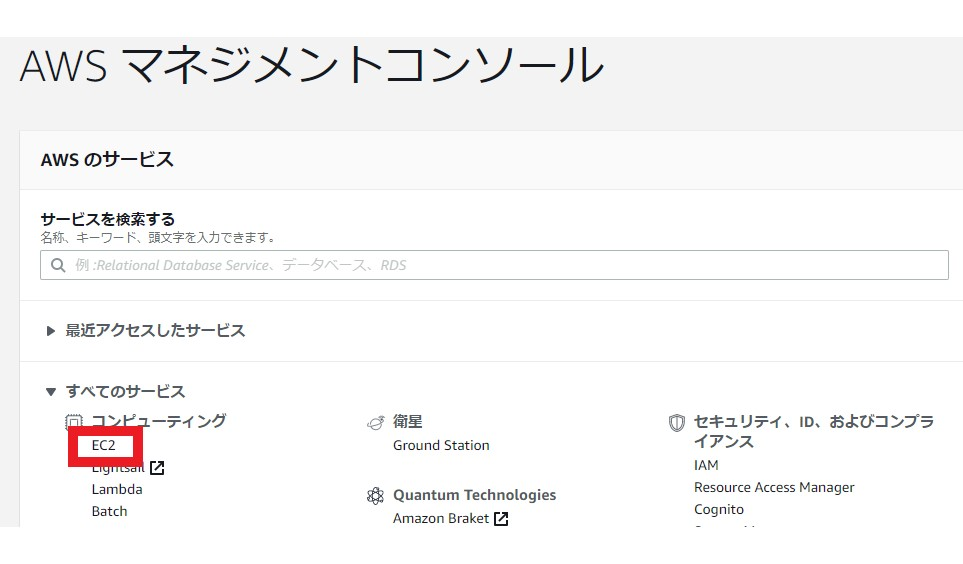

## ラボ環境の使用方法

- [Cloud Skills Boost (Qwiklabs) へのログイン手順](https://qualia906.github.io/skillsboost/how-to-login/)
- [ラボの開始手順 (AWS / GCP)](https://qualia906.github.io/skillsboost/how-to-use-lab/)

<br />    

## ラボ (演習)


### 演習 1：[Introduction to Amazon EC2 Auto Scaling (日本語版)](https://amazon.qwiklabs.com/focuses/52811?catalog_rank=%7B%22rank%22%3A1%2C%22num_filters%22%3A0%2C%22has_search%22%3Atrue%7D&parent=catalog&search_id=19747348)【AWS】

所要時間：40 分

- Qwiklabs へのサイドログインが必要になります。アカウントは同一です。
    
- タスク 1 のステップ 3 では、「すべてのサービス」の「コンピューティング」から [EC2] をクリックします。  
  
  
    

-   タスク１のステップ 7 では、Amazon Linux 2 Amazon Linux 2 (x86) を選択します。

-   タスク 2 のステップ 14 [Auto Scaling グループの詳細設定] では、[ネットワーク] に「デフォルト」ではない方のネットワークを指定してください。
    
-   タスク 3 のステップ 21 では、まず [Auto Scaling グループを表示する] をクリックしてください。

<br /> 

### 演習 2：[Docker の概要](https://www.qwiklabs.com/focuses/1029?catalog_rank=%7B%22rank%22%3A3%2C%22num_filters%22%3A1%2C%22has_search%22%3Atrue%7D&parent=catalog&search_id=4806504)【Google Cloud】

所要時間：1 時間

-   初回にdocker buildコマンドを実行した際に、「Cloud Shell の承認」というダイアログが表示されることがありますが、そのまま承認してください。
    
-   「公開」で Docker イメージを Google Container Registry に push した後の手順では、Cloud Shell ではなく GCP コンソール (GUI) から [ナビゲーション  メニュー] > [Container Registry] をクリックします。
    
-   任意のエディタで内容を書き換える手順において、vi や nano の操作が不安な方は、次のコマンドをコピーして実行してください。  

    ```
    cp -p app.js app.js.org  
    sed -ie 's/Hello World/Welcome to Cloud/' app.js
    ```
  
<br />

### 演習 3：[Introduction to Amazon DynamoDB (日本語版)](https://amazon.qwiklabs.com/focuses/51801?catalog_rank=%7B%22rank%22%3A1%2C%22num_filters%22%3A0%2C%22has_search%22%3Atrue%7D&parent=catalog&search_id=19747351)【AWS】

所要時間：40分
    
- ラボが利用できない場合は、代替演習として [DataStore: Qwik Start](https://www.qwiklabs.com/focuses/941?catalog_rank=%7B%22rank%22%3A5%2C%22num_filters%22%3A0%2C%22has_search%22%3Atrue%7D&parent=catalog&search_id=9212410)  を実行してください。  
  Datastore (Firestore  の Datastore Mode) は、DynamoDB に相当する Google Cloud の NoSQL データベース サービスです。

<br />

### 演習 4：クラウドデザインパターンの適用

-   [AWS クラウドデザインパターン](http://aws.clouddesignpattern.org/index.php/%E3%83%A1%E3%82%A4%E3%83%B3%E3%83%9A%E3%83%BC%E3%82%B8)    
-   [AWS クラウドデザインパターン](http://web.archive.org/web/20171008040110/http:/aws.clouddesignpattern.org/index.php/%E3%83%A1%E3%82%A4%E3%83%B3%E3%83%9A%E3%83%BC%E3%82%B8)（上記が表示されない場合はこちら）
    
<br />  

## Reference

- AWS
  -  [AWS Well-Architected – 安全で効率的なクラウド対応アプリケーション](https://aws.amazon.com/jp/architecture/well-architected/)

 
 - Microsoft Azure   
   -   [Microsoft Azure クラウド設計パターン](https://docs.microsoft.com/ja-jp/azure/architecture/patterns/)
   -   [Microsoft Azure Well-Architected Framework](https://docs.microsoft.com/ja-jp/azure/architecture/framework/)    


- Google Cloud
  -  [Google Cloud ソリューション デザインパターン](https://events.withgoogle.com/solution-design-pattern/)
  -  [Google Cloud アーキテクチャ フレームワーク ](https://cloud.google.com/architecture/framework)
  -  [ハイブリッドクラウドのパターン (ハイブリッドクラウドと Google Cloud)](https://www.slideshare.net/GoogleCloudPlatformJP/cloud-onair-google-cloud-201927-133656441)
